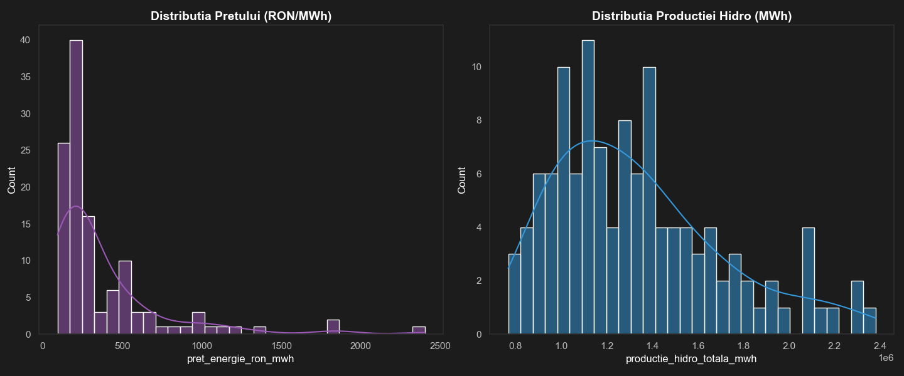
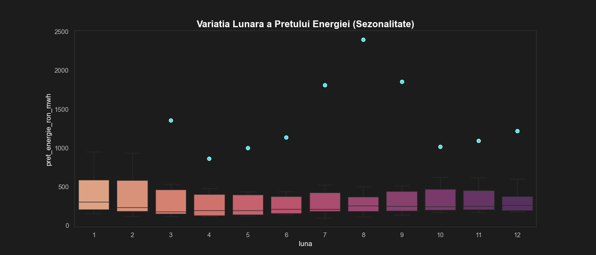
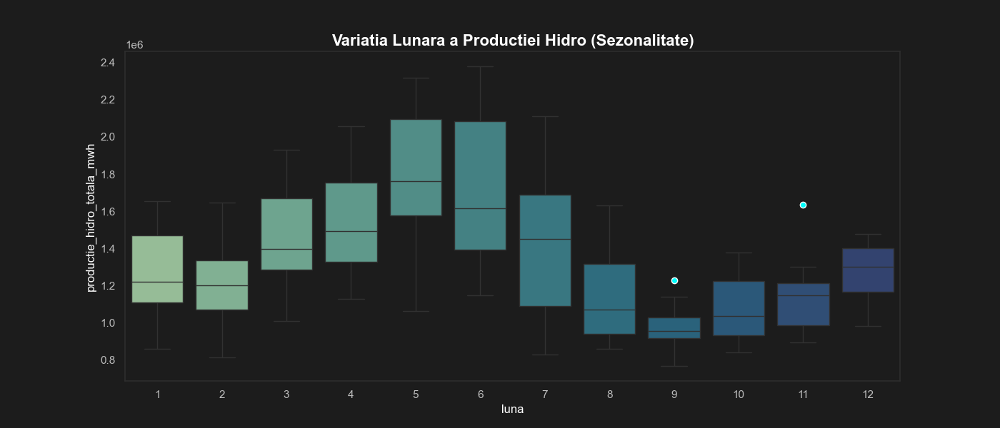

# Romanian Energy Market Analysis

## Overview
Analysis of electricity price drivers and Hidroelectrica S.A. 
financial performance (2015-2025) using machine learning models.

## Key Results
- XGBoost R²=0.909 for electricity price prediction (normal market)
- Crisis regime (2022-2023) identified via KMeans clustering

## Data Sources
- ENTSO-E Transparency Platform (generation, load, prices)
- BNR (EUR/RON exchange rate)
- Hidroelectrica S.A. Annual Reports (2015-2024)

## Models
| Model | R² | MAE |
|---|---|---|
| XGBoost (tuned) | 0.844 | 96.5 |
| XGBoost (no crisis) | 0.909 | 32.1 |
| Random Forest | 0.815 | 104.7 |
| OLS Regression | 0.841 | - |

## Project Overview
This project presents an in-depth data analysis and predictive modeling of the Romanian energy market, with a primary focus on **forecasting electricity prices on the Day-Ahead Market (DAM/PZU)**. Furthermore, it applies these market predictions to a real-world business case: analyzing the revenue impact on **Hidroelectrica**.

Using Data Science techniques and Machine Learning models, this project explores the "Merit Order" effect. It demonstrates how external shocks—specifically the 2022 European natural gas crisis (TTF)—dictated local electricity prices and consequently boosted hydro-generation revenues, even during periods of lower water availability.

## Technologies Used
* **Language:** Python 3
* **Data Manipulation:** `pandas`, `numpy`
* **Data Visualization:** `matplotlib`, `seaborn` 
* **Machine Learning:** `scikit-learn`, `xgboost` 
* **Data Sourcing:** Yahoo Finance (`yfinance`)

## 📊 Data Exploration & Key Insights (EDA)

### 1. Data Distributions: Price vs. Production

* **Price Distribution (Left):** The histogram for electricity prices (`pret_energie_ron_mwh`) shows a heavily right-skewed distribution. Most of the time, prices hover in a "normal" range. However, the long tail extending far to the right clearly captures the extreme market volatility and price shocks, most notably the unprecedented spikes seen during the 2022 energy crisis.

### 2. Lunar Seasonality: The "Hydrological Footprint"

* **Production Seasonality (Hist_3):** This boxplot perfectly illustrates Romania's "hydrological footprint." We observe significantly higher median production and greater variance in the spring months (March - May), driven by snowmelt and spring rains. Conversely, autumn months (September - November) show tighter distributions and lower medians, reflecting typical dry spells.
* **Price Seasonality (Hist_2):** Interestingly, the price seasonality does not perfectly mirror production. While prices tend to be lower during the high-production spring months (showing basic supply-demand mechanics), we see massive outliers in late summer and autumn (specifically August and September). This suggests that factors *other* than hydro supply (such as European gas prices and increased cooling demand) dictate the price peaks.

### 3. Annual Evolution and The 2022 Anomaly

* **Annual View:** Looking at the data grouped by year, the boxplots reveal a stable market from 2018 to 2020. However, starting in late 2021 and exploding in 2022, the median price skyrockets, and the interquartile range stretches massively.
* **The Disconnect:** When comparing the annual price boxplot to the annual production boxplot, the disconnect is clear. The record-high prices of 2022 occurred during a year with relatively average (or even slightly below-average) hydro production. This proves that Hidroelectrica's massive revenues during that period were driven entirely by external market forces (the Merit Order effect), not by increased operational output.

### 4. Correlation Analysis: The Missing Link

* **The Heatmap:** We used a correlation matrix to test how strongly the local supply of water influences the final Day-Ahead Market price.
* **The Finding:** Surprisingly, there is a relatively weak inverse correlation between hydro production volume and the market price. In a standard market, abundant cheap hydro energy should drive overall prices down significantly, but our data shows this isn't the case.
* **Next Steps:** The fact that local water supply does not dictate the market price was the main motivation for our Machine Learning phase. This anomaly prompted us to integrate European Natural Gas (TTF) data into our predictive models to uncover the true underlying driver of electricity prices.
