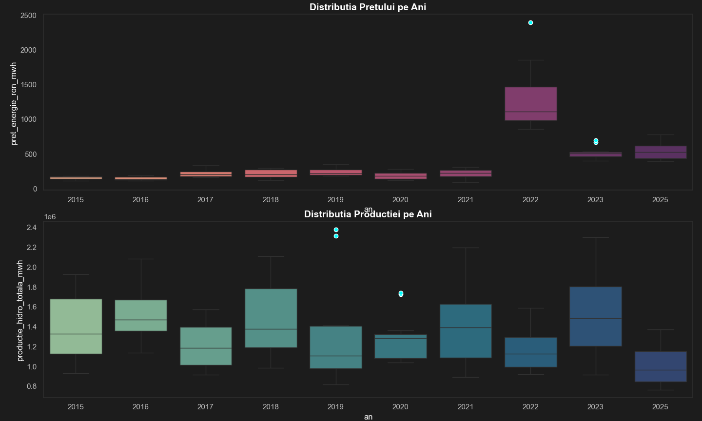
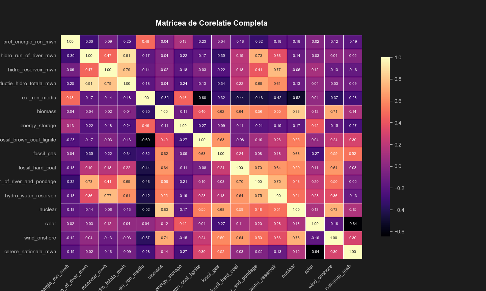
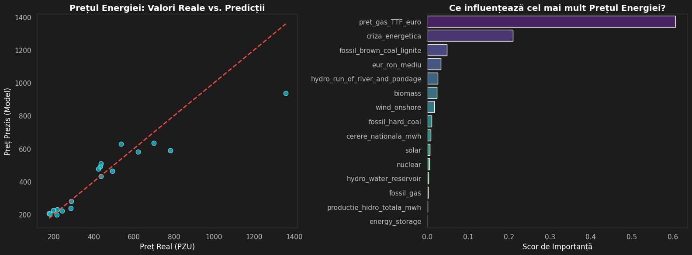
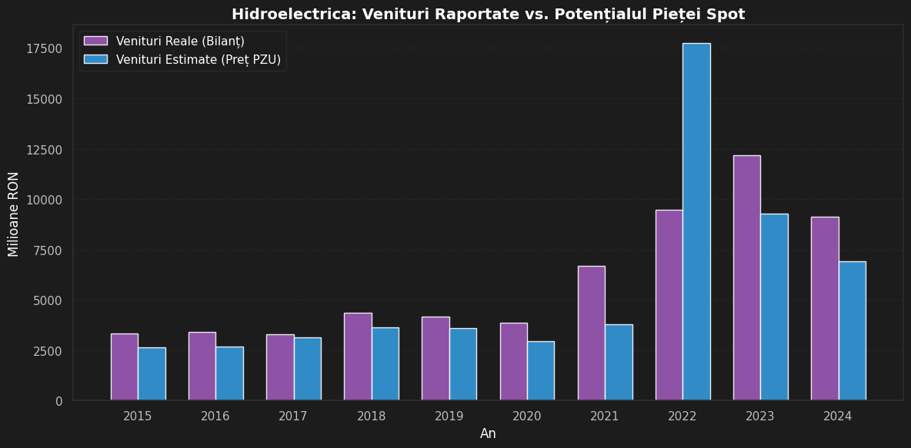
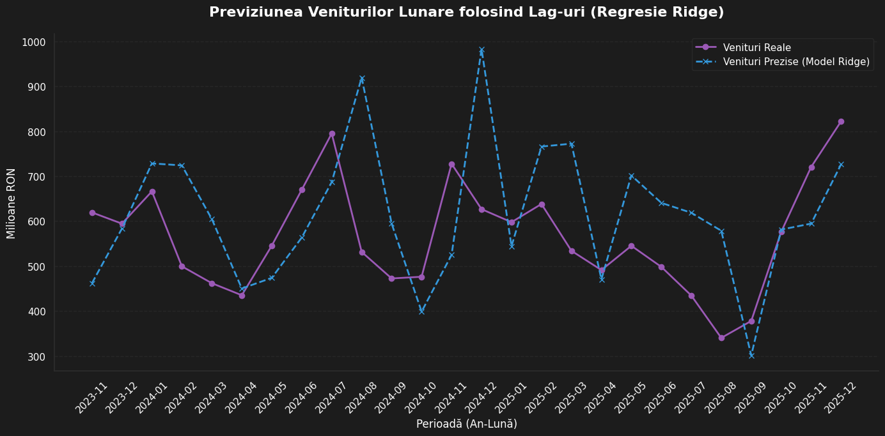

### Electricity Price Modeling & Hidroelectrica Financial Performance (2015–2025)

---

## About This Project

This project started as a university assignment for Software Packages course (Statistics, Year 2, ASE Bucharest) and grew into something I found genuinely interesting.

The central question is simple: **what actually drives electricity prices in Romania?** Is it how much water flows through Hidroelectrica's turbines, or is something else going on?

To answer this, I collected real data from three public sources, cleaned and merged it in Python, and tested several statistical and machine learning models. The results pointed to something I didn't expect at the beginning: local hydro production has a surprisingly weak correlation with electricity prices. The dominant driver, especially after 2021, turned out to be **European natural gas prices (Dutch TTF)**.

---

## Data Sources

| Source | What I Used |
|---|---|
| [ENTSO-E Transparency Platform](https://transparency.entsoe.eu) | Hourly generation by type (hydro, wind, solar, gas, coal, nuclear), national load — 2015 to 2025 |
| [BNR (National Bank of Romania)](https://www.bnr.ro) | Daily EUR/RON exchange rate — 2015 to 2025 |
| [Hidroelectrica S.A. Annual Reports](https://www.hidroelectrica.ro) | Revenue, EBITDA, net profit — 2015 to 2024 |
| [Yahoo Finance (yfinance)](https://finance.yahoo.com) | Dutch TTF Natural Gas monthly prices — 2017 to 2025 |

All data was downloaded manually or via API, cleaned in Python, and aggregated to monthly frequency before modeling.

---

## Structure

```
├── Date_brute/                   # Raw downloaded files
│   ├── BNR/
│   ├── entso_productie/          # Generation CSVs by year
│   ├── entso_preturi/            # Day-ahead price CSVs by year
│   └── Load/
├── Date_curate/                  # Cleaned, monthly aggregated files
│   ├── eur_ron_lunar.csv
│   ├── preturi_energie_lunare.csv
│   ├── productie_hidro_lunara.csv
│   ├── financiar_hidro.csv
│   └── date_analiza_finala.csv
├── curatare_date_bnr.py
├── curatare_date_productie.py
├── curatare_date_pret.py
├── agregare_date.py
├── Analiza_stats.py              # OLS regression (statsmodels)
├── clustering.py                 # KMeans + Logistic Regression
├── Analiza_RandomForest.py       # RF, Lasso, ElasticNet comparison
├── histograme.py                 # EDA visualizations
├── Hidroelectrica.py             # Revenue: real vs. estimated
├── XGB.ipynb                     # XGBoost model comparison + tuning
└── gas.ipynb                     # TTF gas integration
```

---

## Methodology

### Step 1 — Data Cleaning
The raw ENTSO-E files presented a practical problem: generation data before 2022 was recorded at hourly intervals, while 2022 onwards switched to 15-minute intervals. Simply summing the values would have made post-2021 production appear four times larger. I resolved this by computing the duration of each interval from the timestamps directly and converting MW to MWh accordingly.

### Step 2 — EDA
Before any modeling, I looked at distributions, seasonality, and correlations. 

The price distribution (left) is heavily right-skewed with a "fat tail," indicating high volatility and extreme price spikes during the 2022 crisis.


* **Production (`Hist_3`):** Confirms the "hydrological footprint" of Romania, with peak production in spring (March-May) due to snowmelt and lower volumes in late summer.
* **Price (`Hist_2`):** Shows that while production peaks in spring, prices do not always drop proportionally. The highest outliers are recorded in August and September, suggesting that supply-side hydro production is not the only price driver.


Comparing these two boxplots, we observe that while energy prices migrated to a completely different scale in 2022, hydro production remained within historical bounds. This highlights a decoupling of price from local production costs during the energy crisis.


The correlation matrix showed that hydro production has a weak negative correlation (-0.25) with electricity prices. This was the main observation that motivated adding more variables.

### Step 3 — OLS Regression (statsmodels)
I started with a simple OLS model on the 10 annual observations for Hidroelectrica's revenue:

```
Revenue = f(hydro_production, electricity_price, EUR/RON)
R² = 0.841 | Adj. R² = 0.761
```

The results are statistically limited by the small sample (10 years), but the model confirms that EUR/RON is the only individually significant predictor (p = 0.017).

### Step 4 — Clustering (KMeans)
Using monthly data (132 observations), I applied KMeans with 3 clusters on production, price, and exchange rate. The algorithm unsupervised-ly isolated 2022 as a separate regime — all 12 months of 2022 ended up in a single cluster characterized by extreme prices (avg. 1,232 RON/MWh), confirming the geopolitical shock as a distinct market state.


### Step 5 — Machine Learning (Price Forecasting)
I compared 8 models predicting the monthly Day-Ahead Market price using the full energy mix as features:

| Model | R² | MAE (RON/MWh) |
|---|---|---|
| XGBoost | 0.8309 | 101.98 |
| Random Forest | 0.8157 | 104.76 |
| Gradient Boosting | 0.7994 | 111.26 |
| CatBoost | 0.7449 | 96.17 |
| Ridge Regression | 0.5912 | 161.41 |
| Linear Regression | 0.5734 | 171.31 |
| SVR | 0.3837 | 176.37 |
| LightGBM | 0.2963 | 161.03 |

### Step 6 — Geopolitical Regime Analysis
When the 2022–2023 period is excluded, model performance improves substantially:

```
XGBoost (without 2022–2023): R² = 0.909 | MAE = 32.1 RON/MWh
```

This suggests that the underlying market structure is actually quite predictable in normal conditions.

### Step 7 — Adding Dutch TTF Gas Prices
To move beyond the binary crisis indicator, I added the actual 
fundamental driver: monthly Dutch TTF natural gas prices, sourced 
from Yahoo Finance. Both `criza_energetica` and `pret_gas_TTF_euro` 
were kept in the model — TTF captures the magnitude of the price 
shock, while the dummy captures the structural regime shift.

Adding TTF reduced the Mean Absolute Error by ~34%

```
Baseline XGBoost:       MAE = 101.9 RON/MWh
XGBoost + TTF:          MAE = 67.5  RON/MWh
XGBoost + TTF (tuned):  MAE = ~65   RON/MWh | R² ≈ 0.84
```

The feature importance in the final model confirms that **TTF gas is the dominant predictor** of Romanian electricity prices, which is consistent with the Merit Order mechanism — gas-fired plants set the marginal price in a large share of hours.



### Step 8 — Hidroelectrica Revenue Analysis

Using the predicted electricity prices, I estimated what Hidroelectrica's 
revenues *would have been* if all production had been sold at the spot 
market price (PZU), and compared this against the actual reported revenues.


*In 2022, the spot market estimate (blue) far exceeds reported revenues 
(purple), suggesting a significant portion of output was already sold 
under long-term bilateral contracts at pre-crisis prices. From 2023 
onward, the gap narrows as contracts were renegotiated.*

I also attempted a monthly revenue forecast using a Ridge regression 
model with lag features — using last month's production and price 
to predict next month's revenue.


*The model captures the general seasonal trend but struggles with 
sharp month-to-month swings. This is expected given that monthly 
revenues depend on contract structure, which is not publicly available.*
---

## Key Findings

1. **Hydro production alone does not explain electricity prices.** The correlation is weak (-0.25), and models built only on hydro variables perform poorly.

2. **The 2022 energy crisis is a distinct market regime.** KMeans clustering identified it automatically without being told which year was anomalous.

3. **European gas prices (TTF) are the primary driver of Romanian electricity prices**, even though Romania has significant renewable capacity. This reflects the country's integration into the European market and the Merit Order pricing mechanism.

4. **Hidroelectrica's record revenues in 2022–2023 were driven by external market forces**, not by exceptional hydro output. The comparison between reported revenues and spot-market estimates (production × price) shows the company consistently sells below full spot potential, likely due to long-term bilateral contracts.

5. **XGBoost outperformed all other models tested**, including other gradient boosting variants, with the best balance of R² and MAE.

---

## Limitations

- **Small sample for financial modeling:** 10 annual observations for Hidroelectrica's financials limits statistical inference. The OLS coefficients should be interpreted with caution.
- **TTF data availability:** Yahoo Finance TTF data starts from late 2017, limiting the final model's training window.
- **No forward-looking validation:** All models are trained and tested on historical data. No out-of-sample forecasting was attempted.
- **criza_energetica as a dummy variable:** In the baseline ML model, using a manually defined crisis indicator constitutes a form of look-ahead bias. This is appropriate for retrospective analysis but would not be usable in a real-time forecasting context.

---

## Technologies

- Python 3.13
- pandas, numpy
- scikit-learn (KMeans, RandomForest, Lasso, ElasticNet, LogisticRegression, GridSearchCV)
- xgboost, lightgbm, catboost
- statsmodels (OLS)
- matplotlib, seaborn
- yfinance

---

