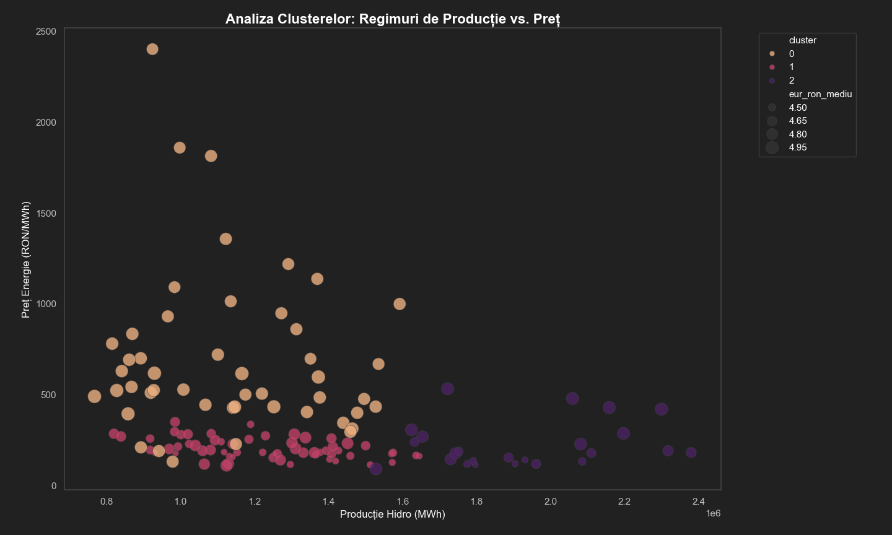

# Romanian Energy Market Analysis

## Overview
Analysis of electricity price drivers and Hidroelectrica S.A. 
financial performance (2015-2025) using machine learning models.

## Key Results
- XGBoost R²=0.909 for electricity price prediction (normal market)
- Crisis regime (2022-2023) identified via KMeans clustering

## Data Sources
- ENTSO-E Transparency Platform (generation, load, prices)
- BNR (EUR/RON exchange rate)
- Hidroelectrica S.A. Annual Reports (2015-2024)

## Models
| Model | R² | MAE |
|---|---|---|
| XGBoost (tuned) | 0.844 | 96.5 |
| XGBoost (no crisis) | 0.909 | 32.1 |
| Random Forest | 0.815 | 104.7 |
| OLS Regression | 0.841 | - |

## Project Overview
This project presents an in-depth data analysis and predictive modeling of the Romanian energy market, with a primary focus on **forecasting electricity prices on the Day-Ahead Market (DAM/PZU)**. Furthermore, it applies these market predictions to a real-world business case: analyzing the revenue impact on **Hidroelectrica**.

Using Data Science techniques and Machine Learning models, this project explores the "Merit Order" effect. It demonstrates how external shocks—specifically the 2022 European natural gas crisis (TTF)—dictated local electricity prices and consequently boosted hydro-generation revenues, even during periods of lower water availability.

## Technologies Used
* **Language:** Python 3
* **Data Manipulation:** `pandas`, `numpy`
* **Data Visualization:** `matplotlib`, `seaborn` 
* **Machine Learning:** `scikit-learn`, `xgboost` 
* **Data Sourcing:** Yahoo Finance (`yfinance`)

## 📊 Data Exploration & Key Insights (EDA)

### Data Distributions: Price vs. Production

* **Price Distribution (Left):** The histogram for electricity prices (`pret_energie_ron_mwh`) shows a heavily right-skewed distribution. Most of the time, prices hover in a "normal" range. However, the long tail extending far to the right clearly captures the extreme market volatility and price shocks, most notably the unprecedented spikes seen during the 2022 energy crisis.

### Lunar Seasonality: The "Hydrological Footprint"

* **Production Seasonality (Hist_3):** This boxplot perfectly illustrates Romania's "hydrological footprint." We observe significantly higher median production and greater variance in the spring months (March - May), driven by snowmelt and spring rains. Conversely, autumn months (September - November) show tighter distributions and lower medians, reflecting typical dry spells.
* **Price Seasonality (Hist_2):** Interestingly, the price seasonality does not perfectly mirror production. While prices tend to be lower during the high-production spring months (showing basic supply-demand mechanics), we see massive outliers in late summer and autumn (specifically August and September). This suggests that factors *other* than hydro supply (such as European gas prices and increased cooling demand) dictate the price peaks.

### Annual Evolution and The 2022 Anomaly

* **Annual View:** Looking at the data grouped by year, the boxplots reveal a stable market from 2018 to 2020. However, starting in late 2021 and exploding in 2022, the median price skyrockets, and the interquartile range stretches massively.
* **The Disconnect:** When comparing the annual price boxplot to the annual production boxplot, the disconnect is clear. The record-high prices of 2022 occurred during a year with relatively average (or even slightly below-average) hydro production. This proves that Hidroelectrica's massive revenues during that period were driven entirely by external market forces (the Merit Order effect), not by increased operational output.

### Correlation Analysis: The Missing Link

* **The Heatmap:** We used a correlation matrix to test how strongly the local supply of water influences the final Day-Ahead Market price.
* **The Finding:** Surprisingly, there is a relatively weak inverse correlation between hydro production volume and the market price. In a standard market, abundant cheap hydro energy should drive overall prices down significantly, but our data shows this isn't the case.
* **Next Steps:** The fact that local water supply does not dictate the market price was the main motivation for our Machine Learning phase. This anomaly prompted us to integrate European Natural Gas (TTF) data into our predictive models to uncover the true underlying driver of electricity prices.

## Statistical Modeling (OLS Regression)

We executed an Ordinary Least Squares (OLS) regression to model Hidroelectrica's revenues based on production, price, and currency rates.

**Key Statistical Metrics:**
* **R-squared:** 0.841
* **Adjusted R-squared:** 0.761
* **Condition Number:** 5.40e+08 (indicating significant multicollinearity).

**Coefficients:**
| Variable | Coefficient | P-Value |
| :--- | :--- | :--- |
| `productie_hidro_totala_mwh` | 0.0008 | 0.077 |
| `pret_energie_ron_mwh` | 4.5834 | 0.053 |
| `eur_ron_mediu` | 10280.7 | 0.017 |

---

## Machine Learning Models (Stage 1)

### Model Comparison (Baseline)
We integrated the full energy mix (Wind, Solar, Nuclear, Coal, Gas production) to predict the PZU price. We tested 8 different algorithms:

| Model | R² Score | MAE (RON/MWh) |
| :--- | :--- | :--- |
| **XGBoost** | **0.8309** | **101.98** |
| Random Forest | 0.8157 | 104.76 |
| Gradient Boosting | 0.7994 | 111.26 |
| CatBoost | 0.7449 | 96.17 |
| Ridge Regression | 0.5912 | 161.41 |
| Linear Regression | 0.5734 | 171.31 |
| SVR | 0.3837 | 176.37 |
| LightGBM | 0.2963 | 161.03 |

**Observation:** While XGBoost provided a high R², the Mean Absolute Error (MAE) of ~102 RON was too high for reliable financial forecasting.

---

## Feature Engineering and Geopolitical Shock Analysis

### The "Energy Crisis" Dummy Variable
To account for the war in Ukraine and the gas supply shock, we introduced a binary (dummy) variable: `criza_energetica`.
* **Value 1:** Late 2021 - Early 2023.
* **Value 0:** Normal market conditions.

The model's ability to follow the extreme spikes improved significantly (as seen in `Figure_2`). By "flagging" the crisis, the model stopped treating the 2022 spikes as random noise and started treating them as a specific market state.

### Removing Crisis Outliers
When we removed the 2022-2023 period to test the model's performance in "stable" conditions, the results were excellent:
* **R²:** 0.908
* **MAE:** 32.10 RON/MWh
This proved that our features (Energy Mix + EUR/RON) are near-perfect predictors when external geopolitical shocks are not present.

---

## Final Model: Integration of Dutch TTF Gas

The final and most accurate version of the model replaced the binary dummy variable with the actual fundamental driver: **Dutch TTF Gas Prices**.

### Hyperparameter Tuning (XGBoost)
Using `GridSearchCV`, we identified the optimal configuration:
* `learning_rate`: 0.01
* `max_depth`: 5
* `n_estimators`: 300
* `subsample`: 0.8

### Results: R² vs. MAE Analysis

**The MAE Victory:**
This is the most critical finding of the project. When comparing the baseline model to the final model (with TTF Gas):
1. **Baseline Model:** R² = 0.83 | **MAE = 101.9 RON**
2. **Final Model (with TTF):** R² = 0.83 | **MAE = 67.5 RON**

**Conclusion:** Although the R² score (which measures variance) remained similar, the **Mean Absolute Error (MAE) dropped by 34%**. In energy trading and revenue forecasting, reducing the absolute error (the actual RON difference) is far more valuable than a theoretical R² percentage. 

### Feature Importance
The final analysis (`Figure_5`, right) confirms that **TTF Gas Prices** is the most dominant feature in determining electricity prices in Romania, proving the "Merit Order" effect where gas-fired plants set the marginal price for the entire market.

---

## 8. Conclusions
* **Primary Driver:** European gas prices (TTF) dictate the Romanian PZU price more than local hydro production.
* **Model Selection:** Gradient Boosting models (XGBoost) are superior to linear models in handling energy market volatility.
* **Forecasting Value:** By including TTF data and crisis indicators, we reduced the forecasting error to a level that allows for meaningful financial planning (MAE 67.5 RON down to 32.1 RON in stable periods).
